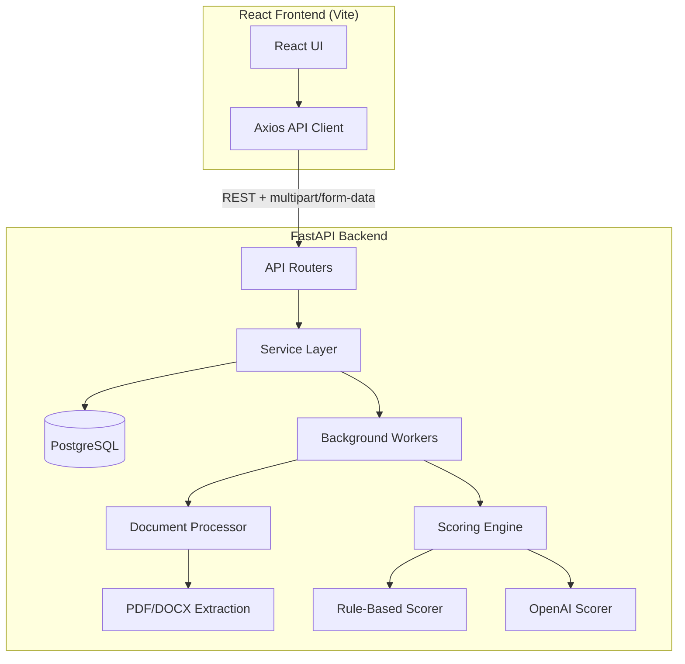
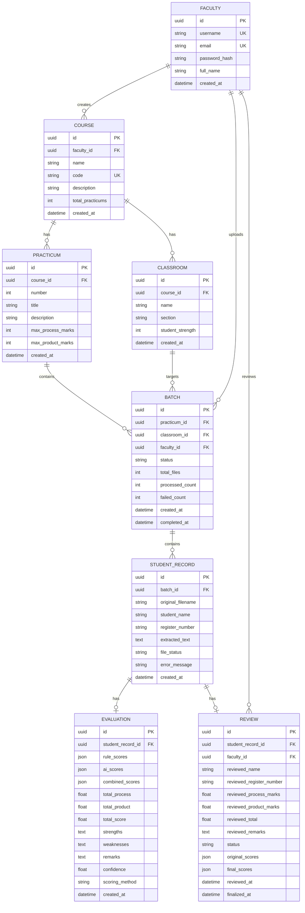

# Triwafernet — Automated University Practicum Assessment Platform

A production-grade SaaS web application for automated assessment of university practicum submissions using hybrid AI + rule-based scoring.

---

## Architecture Overview



**Stack:**
- **Frontend**: React 18 + Vite + Axios + React Router
- **Backend**: FastAPI + SQLAlchemy (async) + Alembic
- **Database**: PostgreSQL (SQLite for dev)
- **Background Processing**: FastAPI BackgroundTasks (upgradable to Celery)
- **Document Processing**: PyMuPDF (fitz) + python-docx
- **AI Scoring**: OpenAI GPT-4o
- **Export**: openpyxl (XLSX) + csv

---

## User Review Required

> [!IMPORTANT]
> **Database choice for development**: The plan uses SQLite for local development and PostgreSQL for production. This allows you to run the system immediately without installing PostgreSQL. Confirm if this is acceptable or if you want PostgreSQL-only.

> [!IMPORTANT]
> **Authentication**: The spec doesn't mention auth. This plan implements a simplified faculty login (username/password with JWT). Should we add full OAuth/SSO support?

> [!IMPORTANT]
> **Background processing**: Using FastAPI `BackgroundTasks` initially (simpler setup, no Redis/RabbitMQ dependency). This is suitable for single-server deployment with moderate load. Celery can be swapped in later. Acceptable?

> [!WARNING]
> **OpenAI API costs**: Each student submission will make one OpenAI API call. For 75 students × 30 practicums = 2,250 calls per class. Ensure you have sufficient API credits.

---

## Project Structure

```
Triwafernet/
├── backend/
│   ├── app/
│   │   ├── __init__.py
│   │   ├── main.py                    # FastAPI app entry point
│   │   ├── config.py                  # Settings & env vars
│   │   ├── database.py                # DB engine & session
│   │   ├── models/
│   │   │   ├── __init__.py
│   │   │   ├── faculty.py
│   │   │   ├── course.py
│   │   │   ├── classroom.py
│   │   │   ├── practicum.py
│   │   │   ├── batch.py
│   │   │   ├── student_record.py
│   │   │   ├── evaluation.py
│   │   │   └── review.py
│   │   ├── schemas/
│   │   │   ├── __init__.py
│   │   │   ├── faculty.py
│   │   │   ├── course.py
│   │   │   ├── classroom.py
│   │   │   ├── practicum.py
│   │   │   ├── batch.py
│   │   │   ├── student_record.py
│   │   │   ├── evaluation.py
│   │   │   └── review.py
│   │   ├── routers/
│   │   │   ├── __init__.py
│   │   │   ├── auth.py
│   │   │   ├── faculty.py
│   │   │   ├── courses.py
│   │   │   ├── classes.py
│   │   │   ├── practicums.py
│   │   │   ├── uploads.py
│   │   │   ├── batches.py
│   │   │   ├── results.py
│   │   │   ├── reviews.py
│   │   │   └── exports.py
│   │   ├── services/
│   │   │   ├── __init__.py
│   │   │   ├── auth_service.py
│   │   │   ├── document_processor.py  # PDF/DOCX text extraction
│   │   │   ├── section_detector.py    # Section detection
│   │   │   ├── scoring_engine.py      # Hybrid scoring
│   │   │   ├── ai_scorer.py           # OpenAI integration
│   │   │   ├── rule_scorer.py         # Rule-based scoring
│   │   │   ├── batch_processor.py     # Background batch processing
│   │   │   └── export_service.py      # CSV/XLSX export
│   │   └── utils/
│   │       ├── __init__.py
│   │       ├── file_validators.py
│   │       └── text_utils.py
│   ├── alembic/                       # DB migrations
│   ├── alembic.ini
│   ├── requirements.txt
│   ├── Dockerfile
│   └── .env.example
├── frontend/
│   ├── public/
│   ├── src/
│   │   ├── main.jsx
│   │   ├── App.jsx
│   │   ├── api/
│   │   │   └── client.js              # Axios instance with interceptors
│   │   ├── components/
│   │   │   ├── layout/
│   │   │   │   ├── Sidebar.jsx
│   │   │   │   ├── Header.jsx
│   │   │   │   └── AppLayout.jsx
│   │   │   ├── upload/
│   │   │   │   ├── FileUploader.jsx    # Multi-file drag & drop
│   │   │   │   ├── UploadProgress.jsx  # Per-file progress
│   │   │   │   └── FileList.jsx
│   │   │   ├── batch/
│   │   │   │   ├── BatchDashboard.jsx
│   │   │   │   ├── BatchCard.jsx
│   │   │   │   └── BatchHistory.jsx
│   │   │   ├── results/
│   │   │   │   ├── ResultsTable.jsx    # Editable data grid
│   │   │   │   ├── ResultRow.jsx
│   │   │   │   └── ScoreBreakdown.jsx
│   │   │   ├── selectors/
│   │   │   │   ├── CourseSelector.jsx
│   │   │   │   ├── ClassSelector.jsx
│   │   │   │   └── PracticumSelector.jsx
│   │   │   └── common/
│   │   │       ├── Button.jsx
│   │   │       ├── Modal.jsx
│   │   │       ├── Toast.jsx
│   │   │       ├── LoadingSpinner.jsx
│   │   │       └── EmptyState.jsx
│   │   ├── pages/
│   │   │   ├── LoginPage.jsx
│   │   │   ├── DashboardPage.jsx
│   │   │   ├── UploadPage.jsx
│   │   │   ├── BatchPage.jsx
│   │   │   ├── ResultsPage.jsx
│   │   │   ├── ReviewPage.jsx
│   │   │   └── SettingsPage.jsx
│   │   ├── hooks/
│   │   │   ├── useUpload.js
│   │   │   ├── useBatch.js
│   │   │   └── useResults.js
│   │   ├── context/
│   │   │   └── AuthContext.jsx
│   │   └── styles/
│   │       └── index.css               # Global styles + design system
│   ├── index.html
│   ├── vite.config.js
│   └── package.json
├── docker-compose.yml
└── README.md
```

---

## Data Model



### Key design decisions:
- **UUIDs** for all primary keys (scalable, safe for distributed systems)
- **BATCH** links practicum + classroom + faculty — one batch per upload session
- **EVALUATION** stores both rule-based and AI scores as JSON for flexibility
- **REVIEW** maintains original vs. final scores for audit trail
- **Status enums**: Draft → Reviewed → Finalized

---

## Proposed Changes

### Backend Foundation

#### [NEW] [requirements.txt](file:///c:/Lenovo%20phd/Project/Triwafernet/backend/requirements.txt)
Core dependencies: `fastapi`, `uvicorn`, `sqlalchemy[asyncio]`, `aiosqlite`, `asyncpg`, `alembic`, `python-multipart`, `python-jose[cryptography]`, `passlib[bcrypt]`, `pymupdf`, `python-docx`, `openai`, `openpyxl`, `pydantic-settings`

#### [NEW] [main.py](file:///c:/Lenovo%20phd/Project/Triwafernet/backend/app/main.py)
- FastAPI app with CORS middleware (allow all origins for dev)
- Include all routers
- Lifespan event for DB table creation
- Health check endpoint

#### [NEW] [config.py](file:///c:/Lenovo%20phd/Project/Triwafernet/backend/app/config.py)
- Pydantic `BaseSettings` loading from `.env`
- `DATABASE_URL`, `OPENAI_API_KEY`, `JWT_SECRET`, `MAX_FILE_SIZE`, `ALLOWED_EXTENSIONS`

#### [NEW] [database.py](file:///c:/Lenovo%20phd/Project/Triwafernet/backend/app/database.py)
- Async SQLAlchemy engine + session factory
- `get_db()` dependency

---

### Models (8 files)

#### [NEW] [models/__init__.py](file:///c:/Lenovo%20phd/Project/Triwafernet/backend/app/models/__init__.py)
Imports all models, exports `Base` for Alembic

#### [NEW] Individual model files
Each model file defines one SQLAlchemy ORM class with:
- UUID primary keys
- Proper foreign key relationships
- Created/updated timestamps
- Status enums where applicable

---

### Schemas (Pydantic)

#### [NEW] schemas/*.py
Request/response schemas for all entities. Separate `Create`, `Update`, and `Response` schemas for each model.

---

### Routers (API Endpoints)

| Router | Endpoints | Description |
|--------|-----------|-------------|
| `auth.py` | `POST /auth/login`, `POST /auth/register` | JWT authentication |
| `courses.py` | CRUD `/courses/` | Course management |
| `classes.py` | CRUD `/courses/{id}/classes/` | Class management |
| `practicums.py` | CRUD `/courses/{id}/practicums/` | Practicum management |
| `uploads.py` | `POST /upload/` | **Critical**: multipart file upload |
| `batches.py` | `GET /batches/`, `GET /batches/{id}` | Batch status & history |
| `results.py` | `GET /results/`, search, filter, sort | Student results |
| `reviews.py` | `PUT /reviews/{id}`, `POST /reviews/{id}/finalize` | Faculty review |
| `exports.py` | `GET /export/` | CSV/XLSX download |

#### Upload endpoint (critical):
```python
@router.post("/upload/")
async def upload_files(
    practicum_id: str = Form(...),
    classroom_id: str = Form(...),
    files: List[UploadFile] = File(...),
    background_tasks: BackgroundTasks,
    db: AsyncSession = Depends(get_db),
):
    # 1. Validate each file (type, size)
    # 2. Create Batch record (status=PENDING)
    # 3. Save valid files, create StudentRecord per file
    # 4. Kick off background processing
    # 5. Return batch_id + per-file validation results
```

---

### Services (Business Logic)

#### [NEW] [document_processor.py](file:///c:/Lenovo%20phd/Project/Triwafernet/backend/app/services/document_processor.py)
- `extract_text_from_pdf(content: bytes) -> str` using PyMuPDF
- `extract_text_from_docx(content: bytes) -> str` using python-docx
- `extract_student_info(text: str) -> dict` — regex-based name/register number extraction

#### [NEW] [section_detector.py](file:///c:/Lenovo%20phd/Project/Triwafernet/backend/app/services/section_detector.py)
- Detect: Observations, Trait mapping table, Interpretation, Conclusion
- Return boolean presence + extracted text per section

#### [NEW] [rule_scorer.py](file:///c:/Lenovo%20phd/Project/Triwafernet/backend/app/services/rule_scorer.py)
- Score process criteria (max 18):
  - Psychometric test completion (4)
  - Accuracy (4)
  - Trait mapping (4)
  - Team discussion (3)
  - Ethics (3)
- Based on section presence and keyword density

#### [NEW] [ai_scorer.py](file:///c:/Lenovo%20phd/Project/Triwafernet/backend/app/services/ai_scorer.py)
- OpenAI GPT-4o integration
- Structured JSON response parsing
- Error handling with fallback to rule-based only
- Rate limiting consideration

#### [NEW] [scoring_engine.py](file:///c:/Lenovo%20phd/Project/Triwafernet/backend/app/services/scoring_engine.py)
- Combines rule-based + AI scores
- Weighted average (configurable)
- Stores full breakdown

#### [NEW] [batch_processor.py](file:///c:/Lenovo%20phd/Project/Triwafernet/backend/app/services/batch_processor.py)
- Background task orchestrator
- Per-file: extract → detect sections → score → store
- Error isolation: one file failure doesn't stop batch
- Updates batch progress in real-time

#### [NEW] [export_service.py](file:///c:/Lenovo%20phd/Project/Triwafernet/backend/app/services/export_service.py)
- Generate CSV/XLSX
- Columns: Register Number | Name | Process | Product | Total (30) | Remarks
- Filter: all vs. finalized only

---

### Frontend

#### [NEW] [index.css](file:///c:/Lenovo%20phd/Project/Triwafernet/frontend/src/styles/index.css)
Design system with:
- Dark theme with purple/indigo accent palette
- CSS custom properties for all tokens
- Glassmorphism cards
- Smooth transitions and micro-animations
- Typography: Inter (Google Fonts)

#### [NEW] [App.jsx](file:///c:/Lenovo%20phd/Project/Triwafernet/frontend/src/App.jsx)
- React Router with protected routes
- Layout with sidebar navigation
- Route definitions for all pages

#### [NEW] Pages (7 files)
Each page component with full functionality:
- **LoginPage**: Faculty authentication
- **DashboardPage**: Overview stats, recent batches, quick actions
- **UploadPage**: Course → Class → Practicum selector + file uploader
- **BatchPage**: Batch detail with progress and file statuses
- **ResultsPage**: Searchable, sortable results table
- **ReviewPage**: Editable results with save/finalize
- **SettingsPage**: Course/class/practicum management

#### [NEW] Components (20+ files)
- **FileUploader**: Drag-and-drop, multi-select (up to 75), FormData upload with progress
- **UploadProgress**: Per-file status indicators (pending/uploading/success/error)
- **BatchDashboard**: Grid of batch cards with status badges
- **ResultsTable**: Editable inline data grid
- **Selectors**: Cascading dropdowns (Course → Class → Practicum)

---

## Scoring Rubric Configuration

| Category | Criterion | Max Marks |
|----------|-----------|-----------|
| **Process (18)** | Psychometric test completion | 4 |
| | Accuracy of results | 4 |
| | Trait mapping | 4 |
| | Team discussion | 3 |
| | Ethics | 3 |
| **Product (12)** | Table clarity | 3 |
| | Interpretation quality | 3 |
| | Conclusion quality | 3 |
| | Report quality | 3 |
| **Total** | | **30** |

---

## Implementation Order

1. **Backend foundation** — config, database, models, schemas
2. **Auth system** — JWT login/register
3. **CRUD routers** — courses, classes, practicums
4. **File upload** — the critical path (multipart/form-data)
5. **Document processing** — PDF/DOCX extraction
6. **Scoring engine** — rule-based + AI
7. **Batch processing** — background orchestration
8. **Review system** — editable results
9. **Export system** — CSV/XLSX generation
10. **Frontend** — all pages and components
11. **Integration testing** — end-to-end verification
12. **Docker + deployment** — containerization

---

## Verification Plan

### Automated Tests
1. **Backend startup**: `uvicorn app.main:app` runs without errors
2. **Swagger UI**: All endpoints accessible at `/docs`
3. **File upload test**: Upload sample PDF/DOCX via Swagger and React UI
4. **Batch processing**: Verify background processing completes
5. **Export**: Download XLSX and verify structure

### Manual Verification
1. **Browser test**: Navigate full workflow (login → upload → review → export)
2. **Multi-file upload**: Test with 10+ files simultaneously
3. **Error handling**: Upload invalid files, verify graceful failure
4. **Review workflow**: Edit scores, finalize, verify audit trail

### Commands
```bash
# Backend
cd backend && pip install -r requirements.txt
uvicorn app.main:app --reload --port 8000

# Frontend  
cd frontend && npm install && npm run dev

# Full stack verification
# Open http://localhost:5173 → Login → Upload → Review → Export
```

---

## Open Questions

> [!IMPORTANT]
> 1. **Sample documents**: Do you have sample practicum PDF/DOCX files? This will help calibrate the text extraction and section detection. Without samples, I'll implement pattern-based detection that can be tuned later.

> [!IMPORTANT]
> 2. **OpenAI model preference**: The plan uses `gpt-4o` for scoring. Would you prefer `gpt-4o-mini` for cost savings, or is accuracy the priority?

> [!NOTE]
> 3. **Student info format**: How are student names and register numbers formatted in the documents? (e.g., "Name: John Doe" at the top, or embedded in headers?) This affects extraction accuracy.
